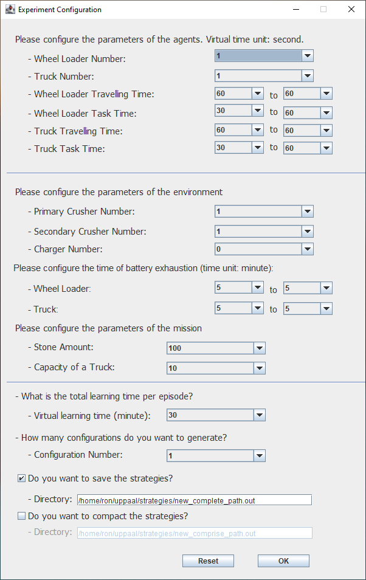

# TACAS21
This is a software for generating random variables and running experiments for our TACAS 21 paper. 

After clicking OK, users will get one or several .xml files of the model. Running these files in UPPAAL Stratego with our external library, one will reproduce the experiment results.
